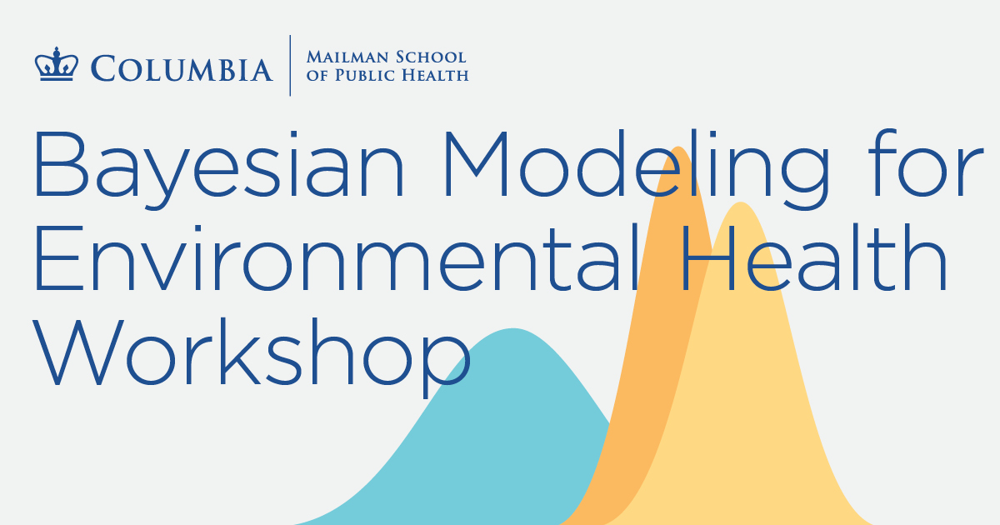

# SHARP: Bayesian Modeling for Environmental Health Workshop

## Introduction

GitHub project through which we're developing and sharing materials for the SHARP Bayesian Modeling for Environmental Health Workshop.

## Notes for those working on the repo

### Using `pre-commit`

Run `pre-commit install` to install the hooks.
You now won't be able to commit until you pass the hooks.
These (among other things) automatically format files and prevent us from committing ugly code.
For more details, see the main [docs](https://pre-commit.com/) and the `R` [docs](https://lorenzwalthert.github.io/precommit/).

### Using `renv`

`renv` maintains consistency between users' `R` environments.
Run `renv::restore()` and the environment will be downloaded into the repository based on the `renv.lock` file.
If you want to add a packages to the lockfile, install the package and then run `renv::snapshot()`.
For more details, see the [docs](https://rstudio.github.io/renv/articles/renv.html).

### Using Quarto for presentations

Quarto is pretty cool.
I won't bore you, but have a look at the [docs](https://quarto.org/docs/guide/).
Here, we're using it for [presentations](https://quarto.org/docs/presentations/revealjs/).
It's designed by the folks at RStudio, so you `R` folk will be happy.
Make a `.qmd` file and run `quarto render *.qmd` to generate the `html`, which you can open in browser.
We can get fancy and import our own `css` to have a consistent theme for out presentations.
